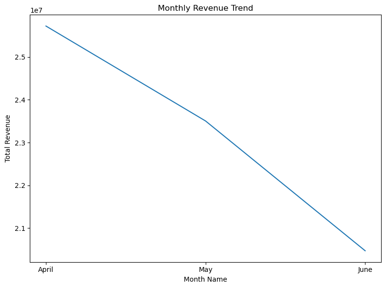
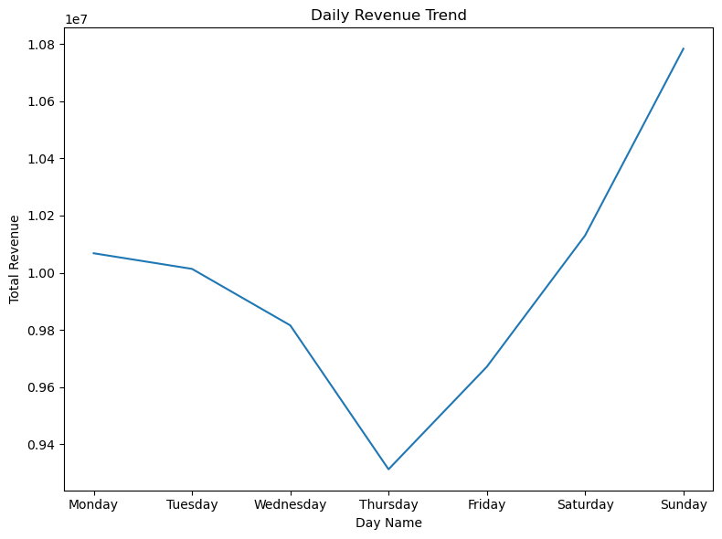
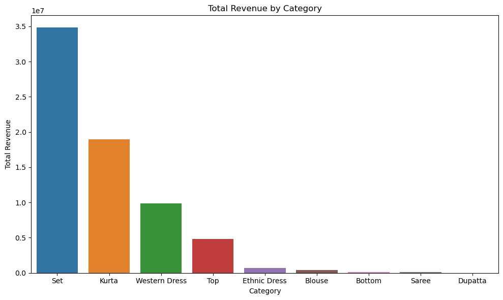
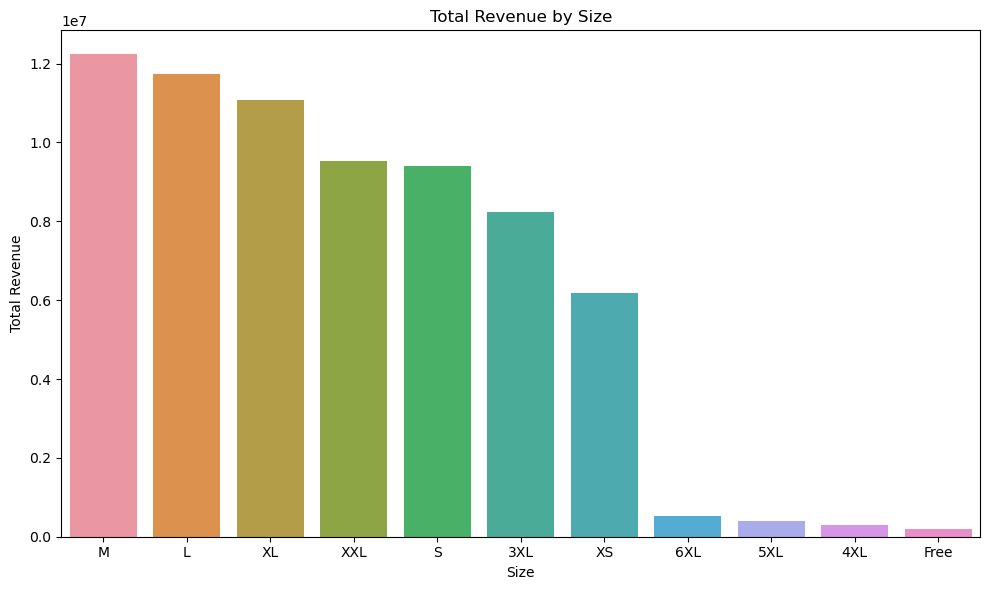
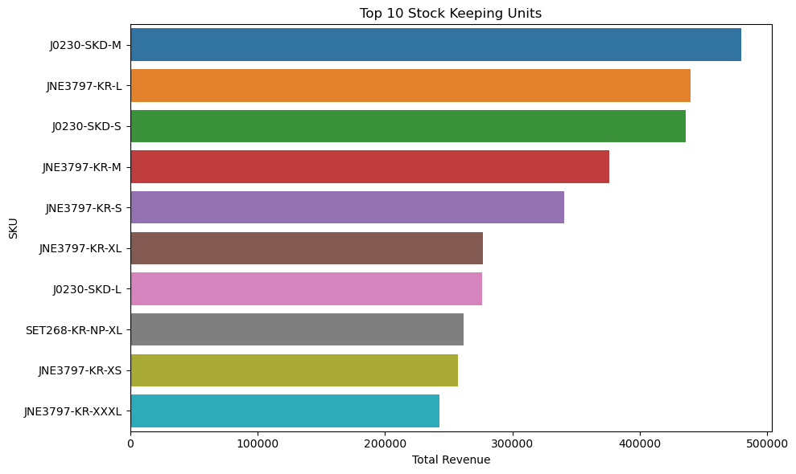
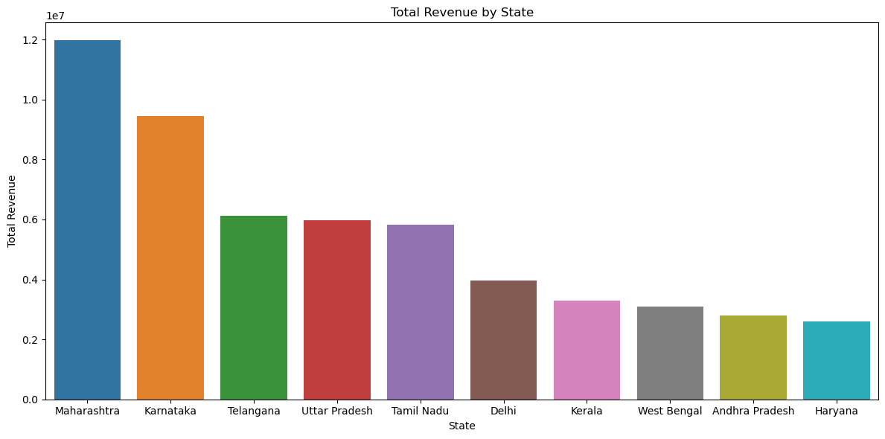
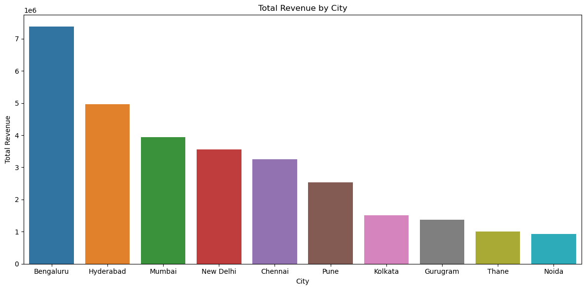
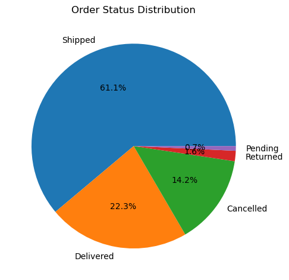
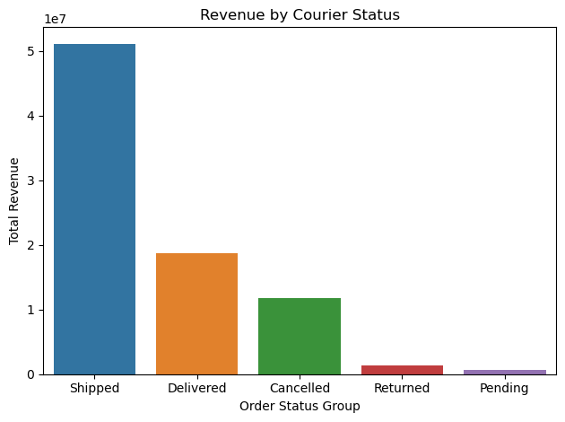
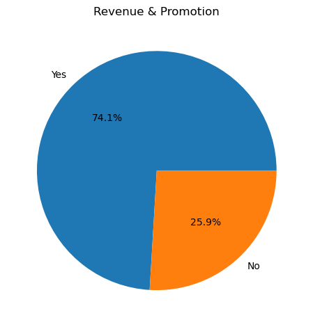

# 🛒 Amazon Sales Analysis using Python

An exploratory data analysis project on Amazon e-commerce sales data using Python, Pandas, NumPy, Matplotlib and Seaborn.

The project analyzes sales performance, order trends, product categories, geographic patterns, fulfilment performance, courier status and promotional activity to identify meaningful business insights.

---

## 📌 Project Overview

E-commerce businesses generate large volumes of transactional data that can be used to understand sales performance and operational patterns.

In this project, the Amazon Sale Report dataset was analyzed using Python to answer questions around:

- How did sales perform over the available period?
- Which product categories and sizes generated the most revenue?
- Which cities and states contributed the most revenue?
- Which SKUs generated the highest revenue?
- How were orders distributed across different statuses?
- How did fulfilment methods contribute to revenue?
- What patterns can be observed in promotional activity?
- What operational patterns can be observed from courier and shipping data?

---

## 🎯 Objectives

The main objectives of this project were to:

1. Clean and prepare the raw Amazon sales data.
2. Perform exploratory data analysis (EDA).
3. Analyze sales and revenue trends.
4. Identify top-performing products and categories.
5. Analyze geographic sales patterns.
6. Examine fulfilment and courier performance.
7. Analyze order status and promotional activity.
8. Generate business insights and recommendations.

---

## 🗂️ Dataset

The project uses the `Amazon Sale Report.csv` file from the following Kaggle dataset:

**Unlock Profits with E-Commerce Sales Data**

The raw CSV is not included in this repository because of its file size.

The analysis specifically uses the `Amazon Sale Report.csv` file from the original dataset.

### Dataset Source

[🔗 Kaggle – Unlock Profits with E-Commerce Sales Data](https://www.kaggle.com/datasets/thedevastator/unlock-profits-with-e-commerce-sales-data/data?select=Amazon+Sale+Report.csv)

---

## 🛠️ Tools & Technologies

- Python
- Pandas
- NumPy
- Matplotlib
- Seaborn
- Jupyter Notebook

---

# 🔄 Project Workflow

## 1. 🧹 Data Cleaning & Preparation

The raw dataset was inspected and prepared before performing the analysis.

Key cleaning steps included:

- Inspecting dataset structure and data types.
- Identifying missing values.
- Handling missing values based on column context.
- Removing unnecessary columns.
- Converting the `Date` column to datetime format.
- Cleaning categorical fields.
- Handling inconsistent and mixed data types.
- Preparing the dataset for further analysis.

---

## 2. 🔎 Exploratory Data Analysis

The dataset was explored to understand its structure and characteristics before performing detailed analysis.

The EDA included:

- Dataset dimensions.
- Column structure.
- Data types.
- Missing-value patterns.
- Date range.
- Unique categories.
- Order status distribution.
- Basic statistical characteristics.

The available transaction data covers approximately three months, from March 2022 to June 2022. Therefore, the analysis focuses primarily on short-term sales patterns rather than long-term time-series analysis.

---

# 3. 📈 Sales Performance Analysis

Sales performance was analyzed across:

- Daily revenue.
- Monthly revenue.
- Order volume.
- Revenue by product category.
- Revenue by size.
- Revenue by state.
- Revenue by city.
- Top-performing SKUs.

### Key Observations

- April generated approximately ₹2.57 Cr in revenue.
- Revenue declined to approximately ₹2.35 Cr in May and ₹2.05 Cr in June.
- Revenue therefore followed the same downward pattern as order volume.
- Sales were concentrated among a relatively small number of product categories and SKUs.
- Certain cities and states contributed substantially more revenue than others.

### Revenue Trend




---

# 4. 📦 Product Analysis

Product performance was analyzed using:

- Product category.
- Size.
- SKU.
- Style.

The analysis was used to identify products and product groups contributing most to overall revenue.

### Key Observations

- A small group of SKUs contributed a significant share of revenue.
- Product categories showed noticeable differences in revenue contribution.
- Certain sizes generated substantially higher sales than others.

### Revenue by Category



### Revenue by Size



### Top 10 SKUs



---

# 5. 🌎 Geographic Analysis

Revenue was analyzed by:

- State.
- City.

This helped identify major revenue-generating markets and areas with comparatively lower sales contribution.

### Key Observations

- Revenue was concentrated in a limited number of states and cities.
- Large urban markets contributed significantly to overall revenue.
- Geographic concentration creates opportunities for targeted regional marketing and inventory planning.

### Revenue by State



### Revenue by City



---

# 6. 🚚 Fulfilment & Operations Analysis

Operational performance was examined through:

- Fulfilment method.
- Courier status.
- Ship-service level.
- Order status.

### Key Observations

- Revenue contribution varied across fulfilment methods.
- Order-status analysis highlighted the distribution of order outcomes.
- Courier-status analysis provided an indication of the operational outcome of shipped orders.
- Ship-service-level analysis provided additional context for understanding fulfilment behaviour.

### Order Status Distribution



### Revenue by Fulfilment


### Revenue by Service Level


### Revenue by Courier Status



---

# 7. 🎁 Promotional Analysis

Promotional activity was analyzed to understand how promotional orders were distributed and how they were associated with revenue.

The analysis examined:

- Promotional activity.
- Revenue associated with promotional orders.
- Distribution of sales across promotional segments.

### Key Observation

- Promotional activity was not evenly distributed, indicating that promotions were concentrated around particular products or sales segments.

### Revenue and Promotion



---

# 💡 Key Insights

1. **Revenue declined during the analyzed period**, falling from approximately ₹2.57 Cr in April to ₹2.05 Cr in June.

2. **Revenue and order volume followed a similar downward pattern**, indicating that lower transaction activity was associated with the decline in revenue.

3. **Revenue was concentrated among specific products and categories**, making top-performing SKUs important contributors to overall sales.

4. **Sales were geographically concentrated**, with a smaller number of cities and states contributing a significant portion of revenue.

5. **Fulfilment and courier-status patterns provide operational insights** that can be used to investigate order and delivery performance.

6. **Promotional activity was not evenly distributed**, indicating that promotions may have been focused on particular products or sales segments.

---

# 📌 Business Recommendations

Based on the analysis, the following actions could be considered:

### 1. Focus on High-Performing Products

Maintain sufficient inventory for top-performing SKUs and categories to reduce the risk of stock-outs.

### 2. Investigate the Revenue Decline

Analyze the factors behind the decline in revenue and order volume from April to June.

### 3. Strengthen Key Geographic Markets

Prioritize marketing, inventory and fulfilment resources in high-revenue cities and states.

### 4. Optimize Product Mix

Use category, size and SKU-level performance to identify products that should receive greater inventory and promotional attention.

### 5. Evaluate Fulfilment Performance

Investigate courier and fulfilment patterns to identify potential operational bottlenecks.

### 6. Measure Promotional Effectiveness

Compare promotional activity with revenue and order performance to determine whether promotions are generating meaningful sales impact.

### 7. Improve Inventory Planning

Use historical product-level demand to improve stock allocation and reduce the risk of overstocking or stock-outs.

---

# ⚠️ Limitations

- The available dataset covers only a short period of approximately three months.
- Long-term seasonality and year-over-year trends cannot be reliably evaluated.
- The analysis is primarily descriptive and does not establish causal relationships.
- Additional business data such as advertising spend, inventory levels, customer acquisition cost and profit margins would enable deeper analysis.

---

# 📁 Repository Structure

```text
amazon_sales_analysis/
│
├── images/
│   ├── daily_revenue_trend.png
│   ├── monthly_revenue_trend.png
│   ├── order_status_distribution.png
│   ├── revenue_and_fulfillment.png
│   ├── revenue_and_promotion.png
│   ├── revenue_and_service_level.png
│   ├── revenue_by_category.png
│   ├── revenue_by_city.png
│   ├── revenue_by_courier_status.png
│   ├── revenue_by_size.png
│   ├── revenue_by_state.png
│   └── top10_sku.png
│
├── amazon_sales_analysis.ipynb
└── README.md
